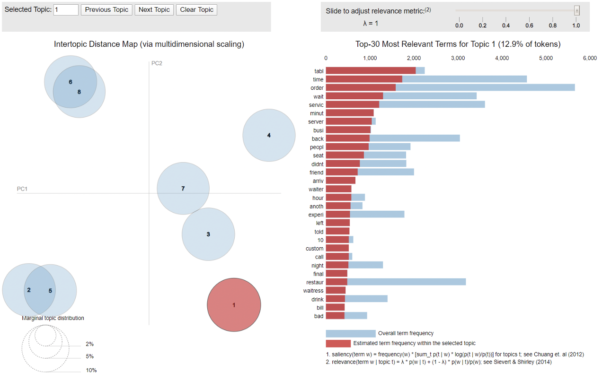
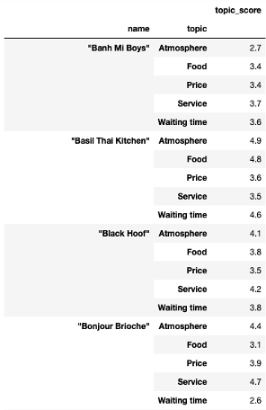

# Topic-Modelling-and-Sentiment-Analysis-Yelp-Reviews
Authors: Jeff Cheah Vyi, Harry Tsang Tsz Hin, Sashank Ramesh, Ho Chin Tee, Shuyi Liu, Shannen Lam Siew Peng 

## 1. INTRODUCTION

Yelp is a business directory service that hosts crowd sourced reviews of businesses founded in 2004, San Francisco. The types of businesses include restaurants, cafes, health centres, retail outlets. etc. Yelp is business-to-consumer application where Yelp users can submit reviews using a rating system. Moreover, users can submit written reviews about the businesses that helps other users make informed decision about products/ services. Our focus, through the course of this project, will be restaurants and the F&B businesses and study reviews and the nature of reviews. 

Yelp users and businesses encounter several pain points that can be addressed with text mining solutions. Firstly, on Yelp, businesses only have 1 consolidated rating, but no rating into the specific aspects of the business, such as Ambience, service or food etc. This means that as a user, I will not be able to filter reviews relevant to the aspect or find out specifics to the restaurant. As a business, it is difficult for me to understand which aspects the business can improve on when they have a low rating. Therefore, the motivation is to alleviate these pain points with topic modelling and sentiment analysis.

## 2. BUSINESS USE CASE

There are two end objectives that our team wish to achieve:

### a.	Detailed Rating System

With the current consolidated business rating, there is no visibility into specific aspects based on the 1-5 rating scale of the rating. Using sentiment analysis to evaluate positive and negative sentiments, we can then score each review and label the review under the specific aspect with topic modelling, therefore giving the average aspect score for each aspect. This can then aid users and businesses to understand the business better.

### b.	Reviews filtering by Aspects

A user currently must scroll through all reviews to understand the business, with some businesses having up to thousands of reviews. However, as a user, you may be only interested in specific aspects of the business, such as whether it has good service or food. With topic modelling via Latent Dirichlet Allocation (LDA), we then assign a topic to the review based on the distribution and frequency of the words in the review. This allows the reviews to be filtered by its dominant topic, allowing the user to find specific reviews that he may be interested in.

## 3. SOLUTION OVERVIEW

To achieve our business task, we plan to explore several techniques in order to achieve the best results. We have therefore used several models as comparison in each of our tasks. We first start off with pre-processing, followed by 3 different type of LDA models for topic extraction, of which include Gensim, Scikit-learn and Mallet. From sentiment analysis, we have done a standard version with a predetermined set of positive and negative lexicons, while comparing it to VADER. These models are then evaluated via several tests to determine the best model, ultimately combining to give the reviews a topic name and score, allowing us to evaluate the business from each aspect, improving Yelp’s usability and convenience.

Figure 1: Solution Overall Design

## 4. SOLUTION DETAILS

As part of the data pre-processing exercise, we want to identify the businesses that are restaurants and are present in the F&B industry as this would be the focus of the project. The dataset contains information of a variety of businesses and so our foremost task was to identify those reviews concerning F&B business. 

We identified the businesses containing the category tag “restaurant” and created a subset of 10,000 random reviews from the dataset. We then subject the filtered data’s review text to the following pre-processing steps. We utilized the langdetect package to identify the language of the review and keep only text that are in English. After removing converting to lower case, removing punctuation and removing standard stop words, we proceed with our topic generation. However, due to the presence of high frequency words, our model was not making sense. As a result, we returned to reprocess again to remove words that have more than 2000 occurrences in the dataset. Finally, we proceed with word stemming. 

Figure 2: Pre-processing Steps

### 4.1 Topic Analysis

In our approach to mine consumer reviews, we will first breakdown each review into various dimensions or topics. As abovementioned, these dimensions can be service, food, ambience, family-friendliness etc. For topic modelling, we will use un-supervised learning algorithm Latent Dirichlet Allocation (LDA) as our model. The reason for choosing this modelling technique is because LDA treats each document as a mixture of topics, and each topic as a mixture of words. This is especially useful in our evaluation of reviews as users often comment on various aspects of their experience in the food establishment. See Table 1 below.
Execution steps:
•	Identify possible topics from reviews
•	Define a function to tokenized reviews line by line with stopwords removed.
•	Convert sentences into word matrix for processing using model

#### 4.1.1 Gensim 

To run LDA algorithm, we deployed three packages to verify which one works the best.  The packages used are LDA Gensim, Scikit-Learn and LDA Mallet. 
In order to get the data ready for execution of LDA model, we used Gensim to create dictionary from these reviews.  Next, using doc2bow function, we converted the reviews to term-frequency-based vectors.  
Once done, we performed LDA these document vectors. We set the number of iterations between a range of 2-8 topics. Along with the iterations, we generated the coherence score to help us evaluation.  We used the matplotlib to enable us to visualise coherence score vs number of topics. See Fig. 3. 
 

Figure 3. Optimal k for Gensim model

In seeking the optimum number of topics, k, we sought higher coherence score. In addition, we examined the output of words, noting that there is no presence of repeated words in each topic, we selected optimal topic of 6.
From the output of the results, we observed with each iteration, the word – topic distribution is dissimilar. This is attributed by the randomness in the algorithm itself. The themes of the words are diverse, ranging from food, general nouns and sentimental words.  Due to this diversity, this pose a challenge to label the topic with more specific labels. 

#### 4.1.2 Sci-kit learn

Figure 4: Perplexity Scores

The Sci-kit module has an LDA package, our data model looks to leverage in order to further dive deeper into the various methods of topic modelling. We use doc2bow function to convert the reviews to the term-frequency based vectors. We run the LDA model for various topic thresholds to determine the most optimal LDA model. The perplexity score is calculated for the LDA models with K topics, where K= 2, 4,6, and 8. Generally, the lower the perplexity score, the better the model is. Refer to Fig.4 that displays the perplexity score for the various topic thresholds.
As is evident from the graph, the most optimal topic threshold is K=4. The perplexity score is lowest for K=4, and, hence, provides a reliable topic distinction. Using the words and topics generated, we assign the most dominant topic to each review in the dataset. It is calculated by comparing the similarity of the review to the list of words in each of the four topics generated. Finally, the highest similarity score indicates the most dominant topic for the review. The topics are then human labelled considering the list of words generated for each topic. The list of topics generated are Service and Time, Fast Food, Breakfast and Pastries, and Food. Refer to Fig.5 for the list of words generated for each of the topics. 

Figure 5. Word-Topic distribution from SK -learn model

The above table represents the top words that contribute to each of the topics. The nature of distribution is not particularly distinct, and we are able to witness some overlap between the topics and the words in them. Hence, this is not a clear representation of an optimal model. The sub-topics are topics about food cuisines and is not particularly representative of the review dataset. In this paper, we discuss the methodology to adopt the appropriate model, which is discussed later.  

#### 4.1.3 LDA Mallet
The next model built is based on Mallet which is also from Gensim library. The primary observation is an improvement of coherence score and the output has a better distinguish of words in different topics. In order to get the best output, we tried with different topic numbers. To select number of topics, one measure is to look at the coherence score (Fig.6):

Number of topics	Coherence score

Figure 6. Coherence scoring from Mallet model

We observed that difference between coherence scores of 8 topics and 10 topics are quite small. Moreover, we believe besides coherence score, we should also look at the words. The LDA model has some randomness in its output, therefore, we have also run multiple times for 8 topics and 10 topics to get the best output. Based on human evaluation, we chose the following model as our final model and labelled the topics as ‘waiting time’, ‘atmosphere’ and ‘service’ to better interpret the topics:

Figure 7. Word-topic distribution from Mallet

We then deployed the package pyLDAvis to help us visualised words distribution for each topic more concisely. See Fig.8 below.

Figure 8: Topic Extraction Visualization

Lastly, we saved the model using following code:
joblib.dump(ldamallet, 'reviews_ldamallet.jl')
The saved model will be used in Part B, sentiment analysis.

#### 4.1.4 LDA Model comparison

Out of the three models built, we had to select one to further our analysis for sentiment grading. The models are assessed by two main criteria. The first-tier assessment compares within model of the same algorithm by means of coherence score and perplexity score. 
The second tier of evaluation which is done across the models is a qualitative assessment of word-topic output. Primarily we manually judged the ease of topic interpretation on every word-set output. Consequently, we introduced word-intrusion on these hand-labelled sets. A third party, or a naïve expert, is then asked to identify the ‘foreign’ word. 
With the abovementioned assessment method, we observed better quality topics from Mallet model and subsequently carry forward sentiment analysis with its results.

#### 4.2.1 Standard Sentiment Analysis

Next, we deploy sentiment analysis techniques to each review. Two sentiment analysis techniques are conducted to our sentiment analysis, they are Standard sentiment analysis and VADER sentiment analysis. 
The sentiment analysis is mainly focus on “text” column in the top10k_en.csv and Standard sentiment analysis is composed of three steps below:
•	Match all the words in each review to the positive and negative lexicons.
•	Calculate the frequency of positive and negative words.
•	Standardize the topic score in 1-5 stars, which complies with the original rating system.
 

Figure 9: Standard Sentiment Analysis Diagram

Figure 10:Sample Standard Output

#### 4.2.2 VADER

The Vader sentiment analysis composed of four steps as below:
•	Text processing: NLTK package will be used for the text processing such as tokenization, lower case, punctuation and stop word removal, and word stemming.
•	Sentiment-relevant text identification: VADER package will be applied to identify sentiment-relevant string-level properties of the input text. 
•	Extract the compound score for each review and summarize the score by averaging it to the topics under a restaurant.
•	Standardize the score to 1-5 stars, which complies with the original rating system.

Figure 11: VADER Sentiment Analysis Diagram

Figure 12: Model output-compound score

Figure 13: Sample VADER Output

#### 4.2.3 Model comparison

After comparing two sentiment models, we eventually chose VADER as our final model for the reasons below:
•	Vader has generally greater variations within topic.
•	Vader scores are standardized into negative, neutral, positive and compound
•	Vader performs very well with emojis, slangs, and acronyms in sentences

Figure 14: VADER emojis processing

Table 1.Sample review of Yelp! Users

## 5. RESULTS AND ANALYSES

### 5.1 Output and Summary Statistics

With the two models chosen respectively for topic modelling and sentiment analysis, we combined the output and append back to the reviews. On the first level, we have the independent reviews with topic and topic score from LDA Gensim and VADER Analysis.  

Figure 15: Review Output at review level

This is then grouped by business level output, to give each level a summarised score for each of the aspects of the restaurant.

Figure 16: Review Output at Business Level

We then explored the distribution to understand better how each the restaurants fare in the popular categories:

Figure 17: Food, Average 3.71

Figure 18: Service, Average 2.99

Figure 19: Flavour, Average 3.35

This shows that based on community reviews, many of the restaurants in the sample set can improve on their service level to help the business to move forward. 

### 5.2 Business Application

Relating back to our use case, there are 3 main features that we can implement with our data science findings to help Yelp:

Figure 20: Proof of Concept Mock-up

Feature #1: Detailed Ratings System
On top of the current consolidated rating, the detailed rating system now breaks down the restaurant by its main aspects, allowing insights into each of the main categories that may influence a customer to dine at this restaurant. A further implementation may be comparing to restaurants in the area to show what is their best aspect and how do they rank amongst those restaurants in the area.

Feature #2: Filtering of Reviews
With topic modelling, we are able to assign a main topic to the user reviews. With restaurants having up to thousands of reviews, not all reviews may be relevant to the user. Filtering allows a quick way to find what is relevant, with checkboxes for each aspects of the restaurant.

Feature #3: Automated labelling
With the automated labelling of the main topic for each review, the user is able to see at a glance what the review is about without going into the details, therefore finding what is relevant.

## 6. DISCUSSIONS AND GAP ANALYSIS (LIMITATION)

This project enabled us to explore the 3 different ways of generating topics namely Sci-kit learn, Gensim and Mallet algorithms. We experienced first-hand the effectiveness of various models. The study has led us to understand each model’s pros and cons.
We explore the ease of deployment of the three algorithms. Sci-kit learn is mainly a machine learning model, therefore the output is only numbers and we will need to stitch it back to the document vector to know what words they are referring to. Gensim is a package that can be installed in python, this allows ease of deployment without additional installation or path definition. Mallet is an external package which has the best performance, however, in order to get it running, there is a series of code to get it running and from our experience as a team, we are unable to get it to run on Macintosh systems. Windows system required a specific set of code to allow it to run.
Due to the vast amount of data available, we are unable to run the language detection and stemming on the full dataset with our machines. We then sampled 10,000 reviews to work with.
These lead to another limitation where we are unable to analyse all the reviews of a business id due to random sampling. As a result, we are unable to get the full picture of the business and the result from our model will not reflect the real situation. However, if we are to only analyse specific business id, we will not be able to get a feel of the industry.

## 7. FUTURE WORK AND CONCLUSION 

Our MVP provides a detailed rating system broken into various categories, that provides insights for business to improve on and for users to decipher the pros and cons of the business. Moreover, our solution enables users to filter on reviews to display the relevant reviews. 
Firstly, one of the key improvements is to build a restaurant specific dictionary for positive and negative sentiment words. Building a domain specific sentiment list of positive and negative lexicon words enhances the exhaustive nature of the list. The outcome of such an exercise is to optimize the current classification and improve the accuracy of the classification. 
Secondly, our prototype covers a preliminary dataset of only 10,000 reviews. Hence, the next steps would be to build a scalable and dynamic real-time topic and sentiment classification of the reviews to enhance the user experience within the Yelp app. We believe that the real-time feature will greatly increase the user experience, thereby increasing user stickiness with the Yelp app. 
Thirdly, our solution can be extended to develop a labelled dataset to better evaluate our topic models and the sentiment classification using a quantitative approach and developing the confusion matrix to progressively improve our data model. At this stage, we currently deploy manual processes such as the intruder method or the coherence rating to evaluate the best model. Hence, we need to build more robust and scalable methods to our model evaluation techniques to further increase our accuracy.

